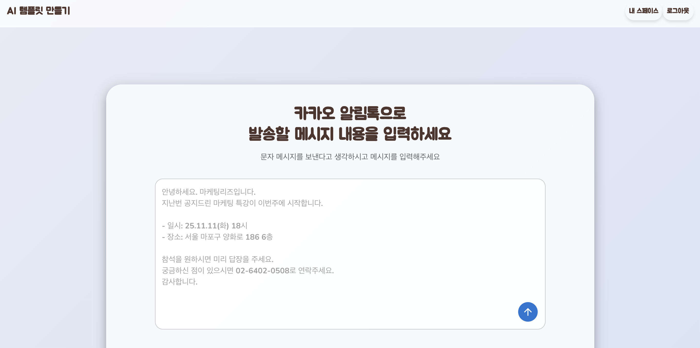
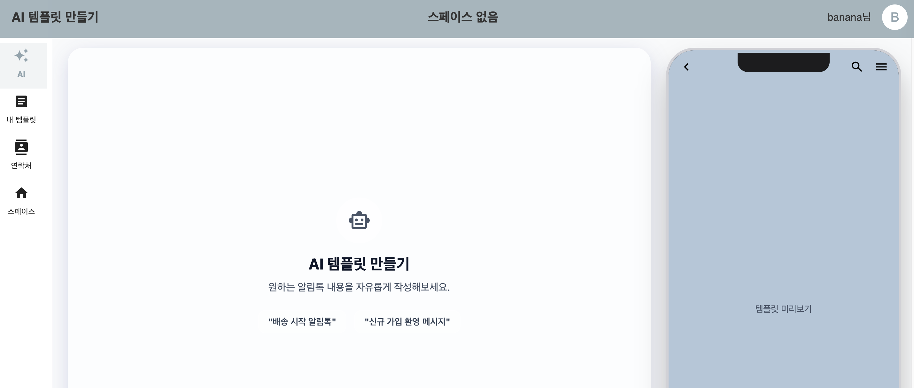

# 카카오톡 알림톡 자동 생성 웹서비스
## 목차
- [소개](#소개)
- [기술 스택](#기술스택)
- [설계 문서](#설계문서)
- [스크린샷](#스크린샷)

## 소개
- 카카오 정책, 정보통신망법에 저촉되지 않는 카카오톡 알림톡을 LLM 으로 생성하는 웹서비스
- 생성된 알림톡 템플릿을 저장 / 관리 가능
- 워크스페이스에 따라 템플릿을 저장 / 관리 가능

## 기술스택
### Server
- Language : Java 21
- Build Tool : Gradle 8.14.3
- Framework : Spring boot 3.5.5
### Database
mysql  Ver 8.0.43-0ubuntu0.24.04.1 for Linux on x86_64 ((Ubuntu))

## 설계문서
- [요구사항 정의서](docs/srs.png)
- [API 명세서](https://api.jober-1team.com/swagger-ui/index.html#/)
- [ERD](docs/ERD.png)
- 클래스 다이어그램

## 스크린샷

